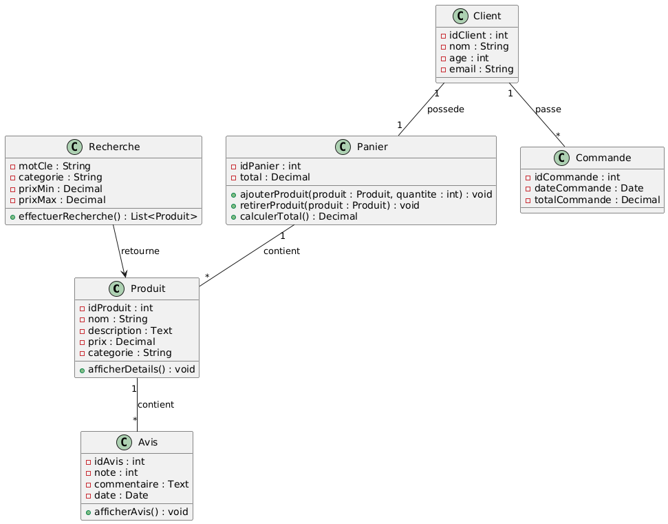

= Document de Conception - Ludorama

== 1. Contexte et Objectifs

=== 1.1 Contexte
Le projet consiste en la création d’un site de vente en ligne de jouets, orienté vers une expérience utilisateur qui distingue les besoins spécifiques des **clients adultes** et des **clients enfants**. Le site doit proposer des fonctionnalités adaptées à chaque type de client, telles que la **visualisation de produits par tranche d’âge**, une **liste de souhaits** pour les adultes, un **système de fidélisation**, des descriptions complètes pour chaque produit, et un filtrage précis pour une expérience d'achat optimisée.

Ludorama, en tant que leader dans la vente de jouets, souhaite moderniser son site web pour offrir une navigation intuitive, des fonctionnalités de personnalisation, et une sécurité renforcée. Le but est de rendre l'achat de jouets en ligne aussi simple et agréable que possible, tout en garantissant la satisfaction des utilisateurs.

Ce document de conception vise à fournir une compréhension claire et détaillée de la solution proposée, en expliquant les aspects fonctionnels et techniques nécessaires à la réalisation du projet. Il sert de guide pour les développeurs, les designers, et les parties prenantes pour assurer la cohérence et la qualité de la solution finale.

=== 1.2 Objectifs
- Offrir aux utilisateurs une expérience personnalisée et sécurisée.
- Répondre aux besoins des clients adultes en leur permettant de noter et de consulter les souhaits de leurs enfants.
- Faciliter la navigation pour les clients enfants en leur permettant de trouver des jouets adaptés à leur âge.
- Mettre en place un système de fidélisation pour récompenser les clients réguliers.
- Assurer une gestion efficace et intuitive des avis et des évaluations des produits.
- Intégrer des fonctionnalités de filtrage avancées pour simplifier la recherche de produits.
- Fournir des informations complètes et détaillées sur chaque produit pour aider les clients à faire des choix informés.

== 2. Description Fonctionnelle

=== 2.1 User Stories et Cas d'utilisation

|===
| **ID** | **User Story**                                                                                       | **Cas d'utilisation**                               |
| US1    | En tant que client, je souhaite accéder à des jeux adaptés à mon âge pour faire une commande rapidement. | CU1 :       |
| US2    | En tant que client enfant, je souhaite visualiser facilement le catalogue afin de trouver les jouets. | CU2 :                 |
| US3    | En tant que client (adulte), je souhaite avoir une liste de souhaits pour noter les envies de mon enfant. | CU3 :             |
| US4    | En tant que client (adulte), je souhaite un système de fidélisation pour accéder aux produits souhaités. | CU4 :               |
| US5    | En tant que client (adulte), je souhaite une description complète des produits pour assurer mes choix. | CU5 :      |
|===

=== 2.2 Use Case
image::/images/USE_CASE/UC.png[]

==== Acteurs
1. *Client* : Représente les utilisateurs qui naviguent sur le site pour acheter des produits.
2. *Administrateur* : Représente l'administrateur du site, chargé de gérer les produits et de modérer les avis.

==== Cas d'utilisation pour le Client
- *Se connecter / Déconnecter* : Le client peut se connecter ou se déconnecter de son compte.
- *Créer compte client* : Permet au client de créer un nouveau compte.
- *Rechercher produits* : Le client peut rechercher des produits en utilisant des mots-clés ou des filtres.
- *Visualiser liste produits* : Affiche la liste des produits disponibles en fonction de la recherche.
- *Trier liste produits* : Permet de trier la liste des produits par critères comme le prix.
- *Visualiser détail produit* : Le client peut consulter les détails d’un produit spécifique.
- *Gérer liste de souhaits* : Le client peut ajouter des produits à sa liste de souhaits.
- *Gérer points fidélité* : Fonctionnalité optionnelle qui permet au client de gérer ses points de fidélité.
- *Visualiser commandes passées* : Le client peut accéder à l’historique de ses commandes.
- *Rédiger avis* : Le client peut laisser un avis sur les produits achetés.
- *Ajouter au panier* et *Gérer panier* : Permet d'ajouter des produits au panier et de gérer son contenu (modifier les quantités ou supprimer des articles).

==== Cas d'utilisation pour l'Administrateur
- *Ajouter / Supprimer produit* : L'administrateur peut ajouter de nouveaux produits ou en supprimer.
- *Gérer les produits* : L'administrateur peut modifier les détails des produits existants.
- *Répondre aux avis* : L'administrateur peut répondre aux avis laissés par les clients pour modérer ou fournir des informations supplémentaires.

==== Relations entre les cas d'utilisation
- *Répondre aux avis* dépend du cas d'utilisation *Rédiger avis*. Cela signifie que les réponses de l'administrateur sont liées aux avis postés par les clients.

=== 2.3 Diagrammes séquences

==== 1. Connexion du client :
image::/images/DS/ConnexionClient.png[]
- Le client envoie ses informations pour se connecter via l'interface Web.
- Le client envoie ses informations pour se connecter via l'interface Web.
- Si les informations sont valides, le client obtient l'accès.

==== 2. Recherche et Visualisation d'un Produit :
image::/images/DS/RechercheVisualisationProduit.png[]
- Le client recherche des produits en fonction de critères spécifiques.
- Le système filtre et récupère les produits correspondants de la base de données.
- La liste des produits est affichée au client, qui peut ensuite voir les détails d'un produit spécifique.

==== 3. Gestion du Panier :
image::/images/DS/GestionPanier.png[]
- Le client ajoute des produits au panier ou modifie le contenu de son panier.
- Le système met à jour le panier dans la base de données.
- Le client voit la confirmation des modifications apportées au panier.

==== 4. Gestion des Avis :
image::/images/DS/GestionAvis.png[]
- Le client peut rédiger un avis sur un produit, qui est stocké dans la base de données.
- L'administrateur peut répondre aux avis du client.
- La réponse de l’administrateur est enregistrée et affichée.

== 3. Architecture et Conception Technique

=== 3.1. Diagramme de classes Métier

image::/images/diagramme_classes_metier.png[Diagramme de classes métier]

Le diagramme de classes métier représente les principales entités du système e-commerce Ludorama et leurs relations. Les classes principales incluent `Client`, `Produit`, `Categorie`, `SousCategorie`, `Marque`, `Panier`, `Commande`, `Paiement`, `Avis`, `Administrateur`, `ListeSouhaits`, et `SystemeFidelisation`.

==== Explication des Classes et Relations

- *Client* : Représente un utilisateur du site. Les attributs incluent des informations personnelles comme l'identifiant, le nom, le prénom, l'email, l'adresse, le téléphone et la date de naissance.
- *Produit* : Représente un produit disponible sur le site. Il a des attributs comme le nom, la description, le prix, le stock, l'âge minimum et maximum recommandé, ainsi que des relations avec `Categorie`, `SousCategorie` et `Marque`.
- *Categorie* : Représente une catégorie de produits. Chaque catégorie peut contenir plusieurs sous-catégories.
- *SousCategorie* : Représente une sous-catégorie de produits, liée à une catégorie.
- *Marque* : Représente la marque d'un produit.
- *Panier* : Représente un panier d'achat, contenant des produits et lié à un client.
- *Commande* : Représente une commande effectuée par un client, incluant un panier et un paiement.
- *Paiement* : Représente un paiement pour une commande, avec des détails sur le type de paiement et la date.
- *Avis* : Représente un avis laissé par un client sur un produit, incluant une note et un commentaire.
- *Administrateur* : Représente un administrateur du site, avec des attributs pour le nom, le prénom et l'email.
- *ListeSouhaits* : Représente une liste de souhaits, permettant aux clients de gérer les produits qu'ils désirent.
- *SystemeFidelisation* : Représente un système de points de fidélité pour les clients, permettant de gagner des points pour les achats effectués.

==== Relations entre les Classes

- Un `Client` peut passer plusieurs `Commande`.
- Chaque `Commande` est liée à un `Panier`.
- Un `Panier` peut contenir plusieurs `Produit`.
- Un `Produit` appartient à une `Categorie` et une `SousCategorie`, et est associé à une `Marque`.
- Un `Produit` peut avoir plusieurs `Avis` laissés par des `Client`.
- Un `Client` peut laisser plusieurs `Avis` sur des `Produit`.
- Une `Commande` est associée à un `Paiement`.
- Un `Client` a une `ListeSouhaits` et un `SystemeFidelisation`.

=== 3.2. Diagramme d'état Commande

image::/images/diagramme_etat_commande.png[Diagramme d'état Commande]

Le diagramme d'état pour la classe `Commande` montre les différents états par lesquels une commande peut passer, ainsi que les transitions possibles entre ces états.

==== Explication des États et Transitions

- *EnCoursTraitement* : L'état initial d'une commande une fois qu'elle est créée. Elle est en cours de traitement.
- *Expediee* : La commande est expédiée au client.
- *Livree* : La commande est livrée au client.
- *Annulee* : La commande est annulée.

==== Transitions

- Une commande passe de `EnCoursTraitement` à `Expediee` lorsqu'elle est expédiée.
- Une commande passe de `Expediee` à `Livree` lorsqu'elle est livrée au client.
- Une commande peut être annulée à partir de l'état `EnCoursTraitement` ou `Expediee`.
- Une commande peut retourner à l'état `Expediee` à partir de l'état `Annulee` si elle est retournée par le client.

=== 3.3. Diagramme de classes de conception

Le diagramme de classes de conception permettent de structurer les principales entités du projet et leurs interactions pour répondre aux besoins fonctionnels identifiés. Dans le contexte de Ludorama, un site de vente en ligne de jouets, ces diagrammes sont essentiels pour assurer une expérience utilisateur fluide et personnalisée.

Le diagramme de classe joint illustre comment le système gère les fonctionnalités de recherche, de visualisation de produit, et d'ajout au panier, tout en prenant en compte les besoins spécifiques des **clients adultes** et des **clients enfants** :

- **Recherche** : La classe `Recherche` est conçue pour permettre aux utilisateurs de trouver rapidement des produits en fonction de critères comme l'âge ou la catégorie de jouet.
- **Visualisation de produit** : La classe `Produit` fournit des informations détaillées sur chaque jouet, incluant des descriptions complètes et des avis, particulièrement utiles pour les **clients adultes**.
- **Ajout au panier** : La classe `Panier` permet de gérer les articles que les utilisateurs souhaitent acheter. Elle est associée à la classe `Client`, représentant la relation entre un client et son panier. Le système de fidélisation est également pris en charge dans cette architecture pour encourager les **clients adultes** à revenir sur la plateforme.

Les relations entre les classes, telles que `Client` et `Panier` ou `Produit` et `Avis`, montrent comment les fonctionnalités sont intégrées pour offrir une navigation intuitive et adaptée aux différents types de clients.

